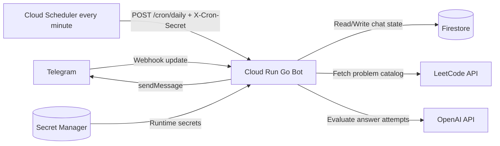

# Architecture

This document describes the runtime architecture and data flow for the Telegram LeetCode bot.

## High-level Components

- Telegram Bot API for inbound updates and outbound messages
- Cloud Run service hosting the Go bot HTTP server
- Firestore for persistent chat state and revision history
- Cloud Scheduler for minute-level daily dispatch ticks
- LeetCode public API for question catalog
- OpenAI API for answer evaluation
- Secret Manager for runtime secret delivery

## System Diagram

## Runtime Endpoints

- `POST /webhook/<WEBHOOK_SECRET>`
  - Receives Telegram updates
  - Handles commands and free-text answer attempts

- `POST /cron/daily`
  - Triggered every minute by Cloud Scheduler
  - Requires `X-Cron-Secret` header
  - Sends daily question when per-chat SGT time matches and not already sent that day

- `GET /healthz`
  - Liveness check endpoint

## Bot Service Structure

- `main.go`
  - Root runtime entrypoint (minimal wrapper)
  - Delegates startup to `internal/app`

- `internal/app/main.go`
  - Shared runtime bootstrap
  - Wires config, clients, service dependencies, and HTTP routes

- `internal/bot/service.go`
  - HTTP handlers, answer evaluation pipeline, question dispatch pipeline

- `internal/bot/commands.go`
  - Command router and command handlers

- `internal/ai/openai_coach.go`
  - AI coach implementation for grading/evaluation

- `internal/leetcode/client.go`
  - Pulls and caches LeetCode question catalog

- `internal/storage/firestore_store.go`
  - Firestore persistence for chat config, served questions, answered questions

## State Model (Firestore)

Collection: `chats/{chat_id}`

Fields:

- `chat_id`
- `daily_enabled`
- `daily_time`
- `timezone`
- `current_question`
- `last_daily_sent_on`
- `updated_at`

Subcollections:

- `served_questions/{slug}`
  - Tracks seen question slugs to avoid repeats

- `answered_questions/{slug}`
  - Tracks answered history
  - Stores attempts, first/last answered timestamps

## Command Flow

1. Telegram sends update to webhook.
2. Bot parses command or free text.
3. For `/lc`, bot chooses unseen question, stores it as `current_question`, fetches statement content via LeetCode GraphQL, and sends it using Telegram MarkdownV2 rich text.
4. For answer text, bot evaluates using AI when available, otherwise heuristic fallback.
5. Bot records answered metadata (`attempts`, timestamps) only when answer is correct (score >= 8) or user sends `/done`.
6. `/skip` replaces current question and does not save it.
7. `/exit` clears `current_question` to end active practice mode without saving it.
8. `/delete <slug>` removes a question from answered history and seen history.
9. `/answered` lists answered history; `/revise` reloads a previous question into `current_question`.

## Daily Scheduling Flow

1. Cloud Scheduler posts to `/cron/daily` every minute.
2. Bot queries chats with `daily_enabled=true`.
3. For each chat, bot compares current local time to chat `daily_time` in configured timezone.
4. If due and `last_daily_sent_on` differs from today, bot sends unique question and updates sent date.

## AI Fallback Strategy

- If AI is enabled and key is present, bot attempts OpenAI evaluation.
- On AI error, bot logs the error and falls back to deterministic heuristic guidance.
- Bot remains functional even with AI disabled.

## Security Boundaries

- Webhook path secret protects Telegram endpoint discovery
- Cron secret header protects scheduler endpoint
- Optional username allow-list (`ALLOWED_TELEGRAM_USERNAMES`) restricts who can interact with the bot
- Runtime secrets are injected from Secret Manager
- Terraform state still contains sensitive inputs used for secret version seeding; secure state backend and access
